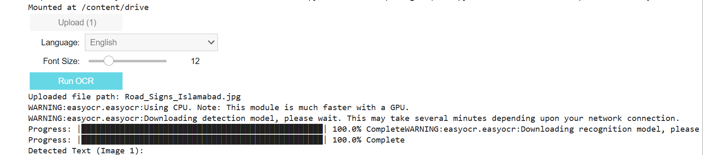

# EasyOCR Image Text Extractor (Colab) 

[](https://www.python.org/)  
[](https://colab.research.google.com/drive/1OVDdqlqz5EAE1Q5W4fLKRymfqt6U75ty?usp=sharing)  
[](LICENSE)

An **interactive OCR (Optical Character Recognition) tool** built with **EasyOCR** and **Google Colab**. 
Extract text from images in multiple languages, visualize detected text with bounding boxes, and interact with your images via a user-friendly GUI.

---

## Preview

**Upload GUI:**  
  

**Annotated Output:**  
  

> **Note:** GitHub cannot render `ipywidgets` properly. Open this notebook in **Google Colab** to interact with the GUI.  
> [](https://colab.research.google.com/drive/1OVDdqlqz5EAE1Q5W4fLKRymfqt6U75ty?usp=sharing)

---

## Features

- Upload and process **multiple images** simultaneously  
- OCR support for **English** and **Urdu**  
- Annotated images with bounding boxes for detected text  
- Adjustable font size for better visualization  
- Interactive GUI using `ipywidgets`  
- Works seamlessly in **Google Colab**

---

## Technologies Used

- **Python**  
- **EasyOCR** – Optical Character Recognition  
- **Google Colab** – Interactive notebook execution  
- **Pillow (PIL)** – Image processing  
- **ipywidgets** – Graphical user interface

---

## How to Run

1. Open the notebook in **Google Colab**.  
2. All required libraries are already included, but you can manually install if needed:
   ```bash
   !pip install easyocr ipywidgets pillow
3. Upload images using the GUI
4. Click **Run OCR**

---

## Note on Dataset 
This project does not include a dataset. 
Users upload their own images at runtime. 

---

## Author 
Chaudhary Waqee Ahmad
